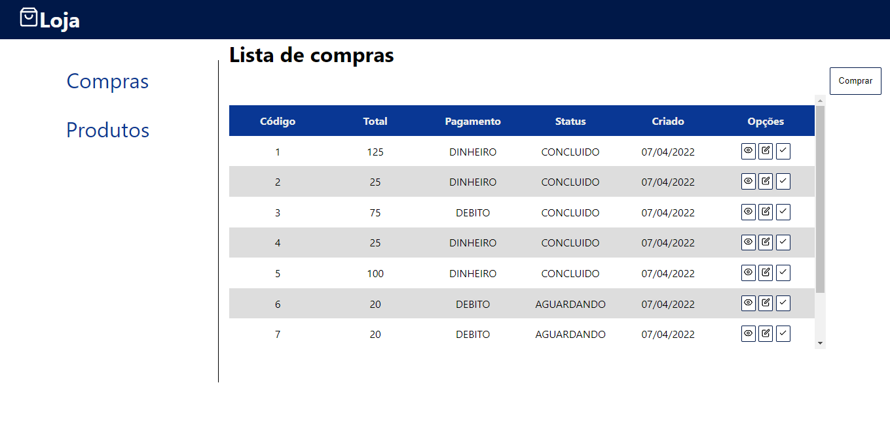
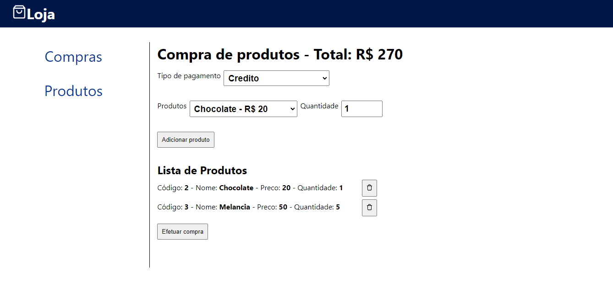
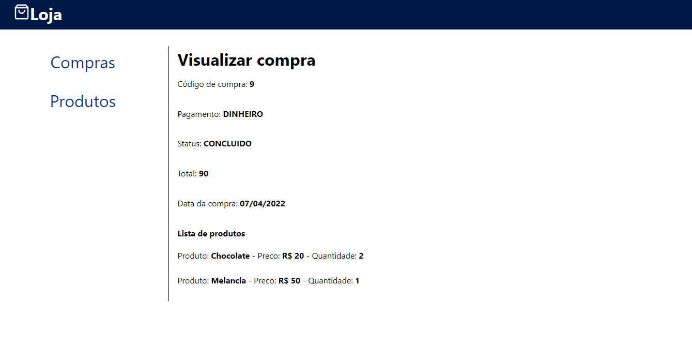
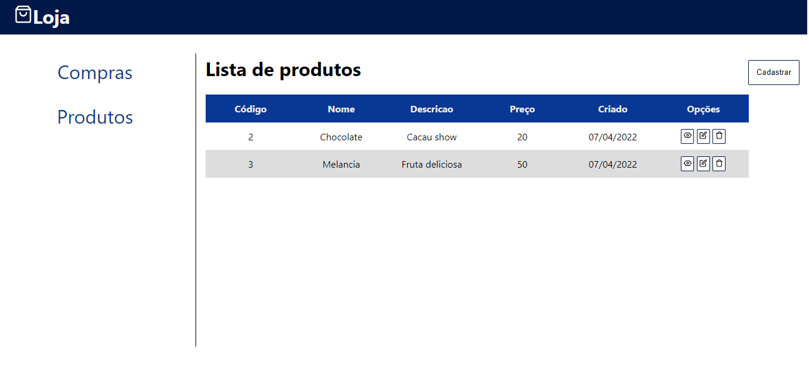
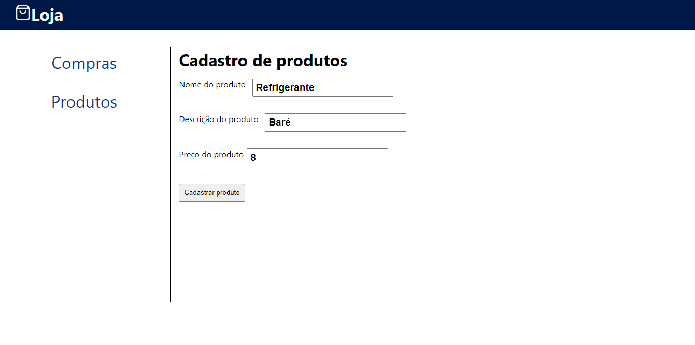
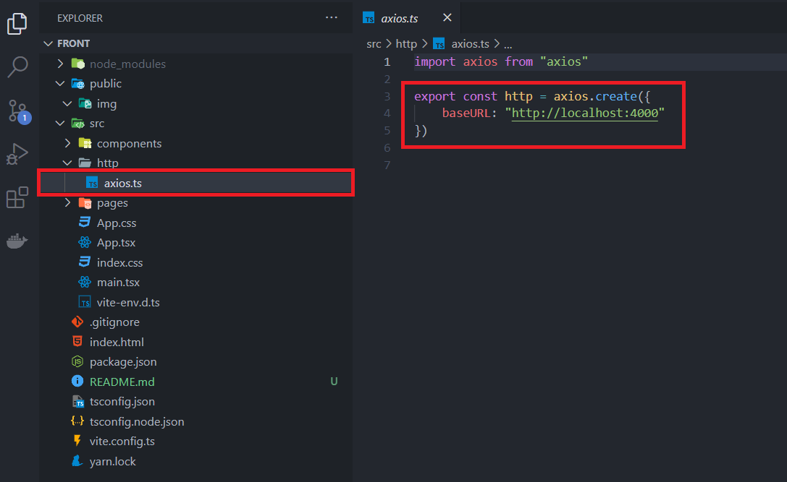

## node_loja_frontend

É um sistema de loja que visa efetuar compras a partir de uma lista de produtos que é servida pelo backend.

#### Requisitos do sistema
- Node

#### Telas

Lista de compras

Efetuar compra

Visualizar compra

Lista de produtos

Cadastro de produtos

#### Passo a Passo para instalação:

1. Baixar repositório do GIT

2. Instalar dependências do NODE
   - npm install
   - yarn

3. Configurar o axios para a porta do BACKEND

4. Rodar o script do sistema:
    * npm run dev
    * yarn dev

[Link do figma base para as telas](https://www.figma.com/file/dCoZmzqT1KObVkLGjuO7MU/Lojinha)
